## 操作系统

进程管理
处理机管理和死锁
存储器管理
文件管理
设备管理


考核点：
- 作业调度算法
- 进程的同步与互斥
- 银行家算法避免死锁
- 页式内存管理逻辑地址到物理地址的转换
- 段式内存管理逻辑地址到物理地址的转换
- 虚拟内存管理的页面置换算法
<br>
- 链式、索引存储文件存储空间的换算
- UNIX系统外存文件的三级索引结构
- 成组链接法外存空间的分配与回收
- 磁盘寻道算法
- 磁盘扇区旋转算法

||知识点|题型|题型易考点|
|--|--|--|--|
|1|掌握操作系统的功能、特征、分类|选择题|操作系统的功能、特征|
|2|1. 进程的定义、及为什么引进进程。<br>2. 进程的状态切换。<br>3. 进程的同步与互斥。<br>4. 线程。|选择题|1. 进程的定义、进程与线程的区别<br>2. 进程状态。<br>3. 信号量的定义。<br>4. 管理。<br>|
|3|1. 作业调度算法。<br>2. 进程调度算法。<br>3. 死锁产生的必要条件。<br>4. 银行家算法避免死锁。<br>5. 资源分配图对死锁的判定|选择题、<br>综合分析题|1. 作业调度算法。<br>2. <br>死锁产生的原因。<br>1. 作业调度算法。<br>2. 银行家算法。<br>3. 永久资源和临时资源分配图化简判定是否有死锁发生。|
|4|1. 程序地址再定位。<br>2. 分区存储管理方案。<br>3. 分页存储管理方案的确定。<br>4. 分段存储方案的确定。<br>5. 虚拟内存管理的页面置换方法。|选择题、综合分析题|1. 程序地址再定位的方式。<br>1. 分页管理的内存寻址。<br>2. 分段管理的内存寻址。<br>3. 页面置换算法。|
|5|1. 通道。<br>2. I/O控制方式。<br>3. **缓冲区管理**。<br>4.磁盘寻道算法。<br>5. 磁盘扇区旋转算法。|选择题、综合分析题|1. 通道类型<br>2. I/O控制方式。1.缓冲区管理方法。<br>2. 磁盘寻道算法。<br>3. 磁盘扇区旋转算法。|
|6|1. 文件的逻辑结构。<br>2. 文件的物理结构。<br>3. 目录管理。<br>4. 外存空间的管理。<br>5. 文件大共性和保护。|选择题、综合分析题|1. 目录概念和组织方式。<br>2. 文件的共享和保护机制。<br>1. 文件的逻辑和物理结构。<br>2. 外存空间的管理。|
|7|1. 命令接口。<br>2. 系统功能调用接口|选择|1. 命令的方式，命令如何进行组织。<br>2. 系统功能调用。|
操作系统的四大功能：CPU管理、存储器管理、文件系统、设备管理，以及为用户的使用提供接口。

<style> 
.ex{ color:DarkBlue;font-size:18px;font-weight:800;text-align:center} 
</style> 

<div align="center"> 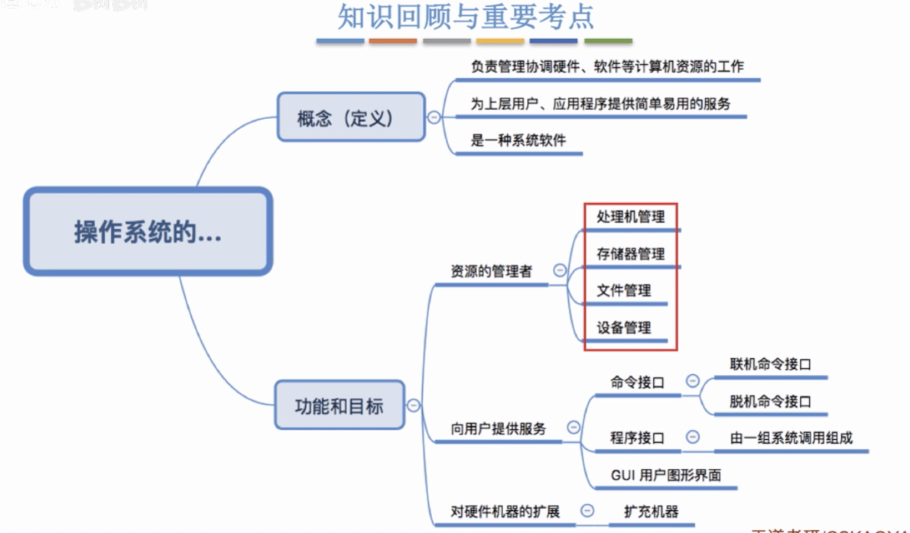 </div> 
<br>
<center class = "ex"></center>
<div class = "ex">操作系统知识点</div>
<br>
<div align="center"> 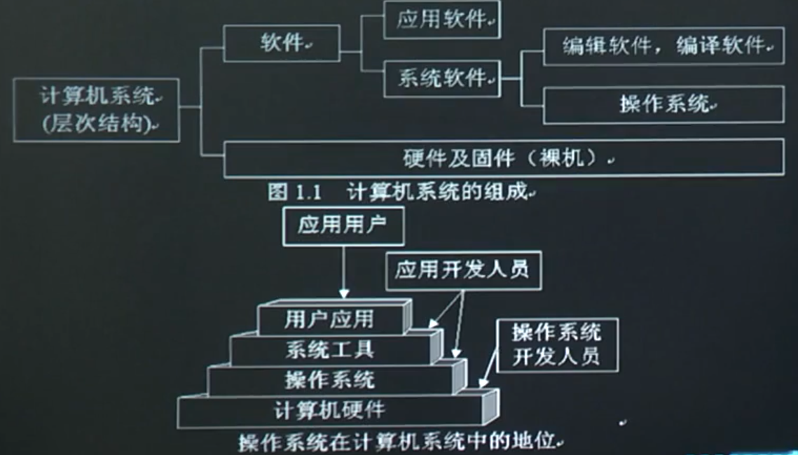 </div> 
<center class = "ex"></center>
<div class = "ex">操作系统的地位和作用</div>
操作系统分类：单道批处理系统；多道批处理系统；分时系统；实时系统；网络操作系统；分布式系统。
分布式系统的特征：模块性、并行性。


<br><br><br><br><br><br>
<br><br><br><br><br><br>

---


### 操作系统的基本特征：
#### 并发
并发性和并行性是两个相识但不同的概念。并发指两个或多个事件在同一时间间隔内发生，这些事在宏观上是同时发生的，但在微观上是交替发生的。并行指两个或多个事件在同一时刻发生。
#### 共享
共享即资源共享，是指系统中的资源可供内存中多个并发执行的资源共同使用。分为互斥共享方式和同时共享方式。同时共享可以多设备同时进行访问。
<div align="center">  </div> 
<center class = "ex"></center>
<div class = "ex">两种共享的方式</div>
所谓“同时”往往是宏观上的，在微观上，这些进程可能是交替地对该资源进行访问（即分时共享）


#### 虚拟
把一个物理实体虚拟为若干个逻辑上的虚拟实体，提高资源的利用率物理实体是实际存在的，而逻辑上的对应物（虚拟实体）是用户感受到的。20200312000853.png
<div align="center"> 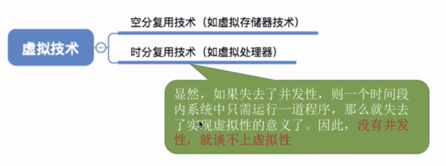 </div> 
<center class = "ex"></center>
<div class = "ex">虚拟技术</div>

#### 异步性
异步是指，在多道程序环境下，允许多个程序并发执行，但由于资源有限，程序的执行不是一贯到底的，而是走走停停，以不可预知的速度向前推进，这就是程序的异步性。
允许多个进程并发执行。

### 总结
<div align="center"> 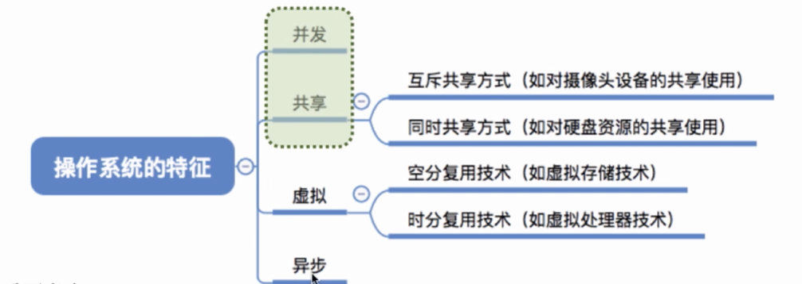 </div> 
<center class = "ex"></center><br>
<div class = "ex">操作系统的特征</div>

---

## 操作系统的发展与分类
<div align="center"> 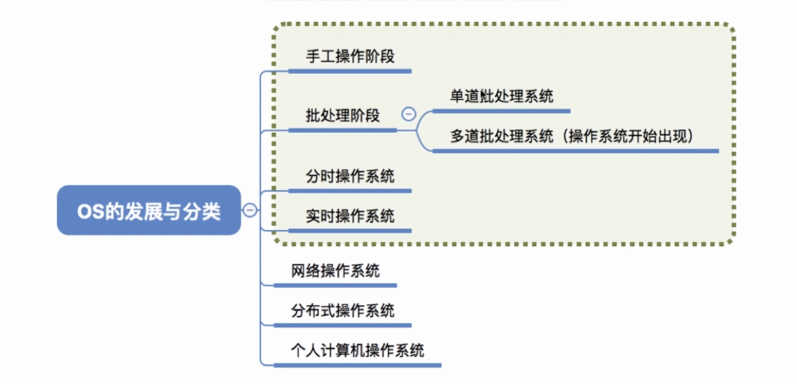 </div> 
<center class = "ex"></center><br>
<div class = "ex">操作系统发展与分类</div>

**多道程序设计**：把一个以上的程序放入内存中。并且同时处于运行态，这些程序共享CPU和其他资源，特点：多道（内存中的程序任意时刻处于就绪、运行、阻塞三种状态之一）宏观上并行，微观上串行。
主要优点：并发执行，共享计算机资源。资源利用率大幅提升。
主要缺点：用户响应时间长，无有人机交互功能。


**分时系统**
分时操作系统：计算机以时间片为单位轮流为各个用户/作业服务，各个用户可以通过终端与计算机进行交互。
主要优点：用户请求可以被及时响应，解决了人机交互的问题，多个用户可以相互独立的同时使用一台主机。
主要缺点：不能优先处理一些紧急任务。
**实时系统**
主要优点，能够优先响应一些紧急任务。实现实时控制和实时信息处理。
<div align="center">  </div> 
<center class = "ex"></center><br>
<div class = "ex">实时操作系统</div>

**网络操作系统**
特点：分布性，自治行，互联性，可见性，实现资源的共享
分布式系统能够对系统中的各类资源进行动态分配和管理，能够实现资源的共享和计算的共享。具有模块性和并行性的特点。
## 总结

<div align="center"> 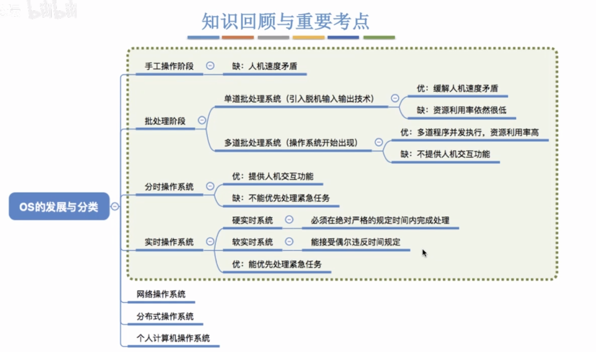 </div> 
<center class = "ex"></center><br>
<div class = "ex">操作系统分类</div>

---
## 操作系统的运行机制与体系结构
<div align="center"> 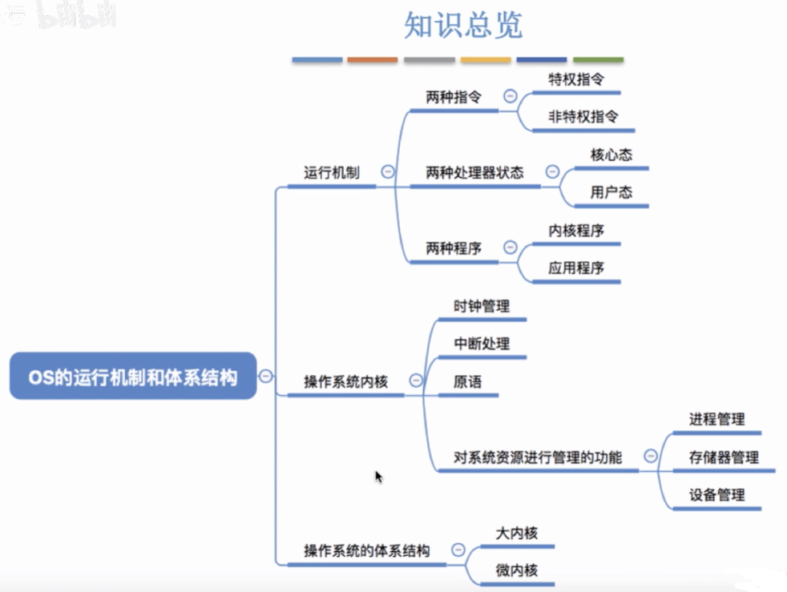 </div> 
<center class = "ex"></center><br>
<div class = "ex"></div>
<div align="center"> 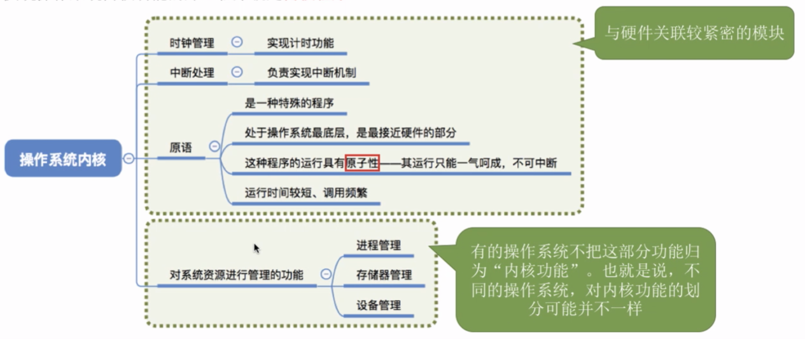 </div> 
<center class = "ex"></center><br>
<div class = "ex">操作系统内核</div>
#### 命令接口
1. 联机命令接口
2. 脱机命令接口（批处理）
#### 程序接口（系统功能调用接口）
程序调用类型：
进程控制类系统调用
（1）. 创建和终止进程的系统调用
（2）. 获得和设置系统属性的系统调用
（3）. 等待某时间出现的系统调用
文件操纵类系统调用
（1）. 创建和删除文件
（2）. 打开和关闭文件
（3）. 读和写文件
进程通行类系统调用。
#### 系统功能调用
系统调用及时实现
程序的状态: 计算机系统中的程序大体上分为系统程序和用户程序，前者是后者的管理者，于是引入
**管态**（系统态）：操作系统运行的状态
**算态**（目态）：用户程序运行的状态
**特权指令** 一类只能在管态下执行而不能在算态下执行的指令。
**访管指令** 本身不是特权指令，能引起访管中断。
#### 图形接口
即图形化操作界面。

<div align="center"> 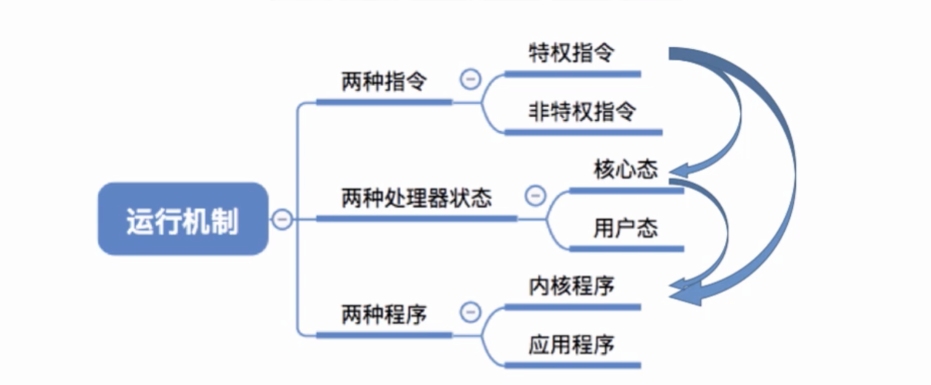 </div> 
<center class = "ex"></center><br>
<div class = "ex">两种子令、两种处理器状态、两种程序</div>

## 总结
<div align="center"> 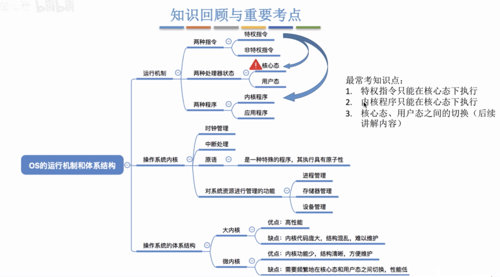 </div> 
<center class = "ex"></center><br>
<div class = "ex"></div>

---

## 中断和异常

<div align="center"> 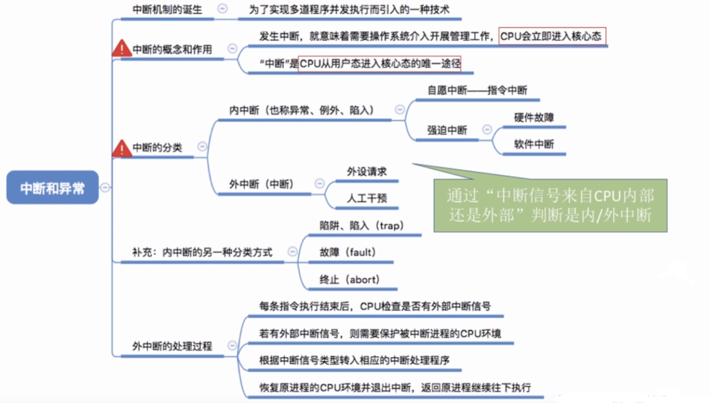 </div> 
<center class = "ex"></center><br>
<div class = "ex"></div>

---

## 系统调用
<div align="center"> 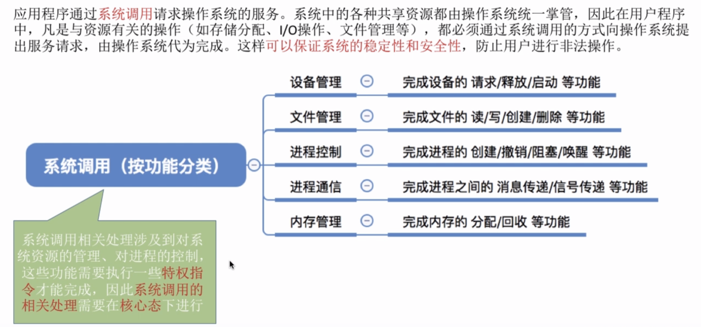 </div> 
<center class = "ex"></center><br>
<div class = "ex">什么是系统调用</div><br>
<div align="center"> 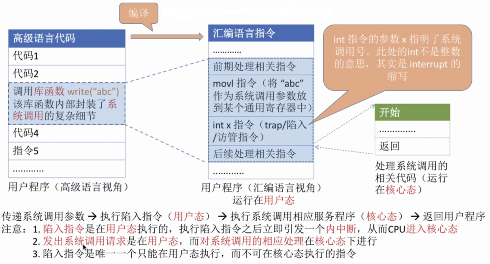 </div> 
<center class = "ex"></center><br>
<div class = "ex">系统调用背后的过程</div><br>
<div align="center"> 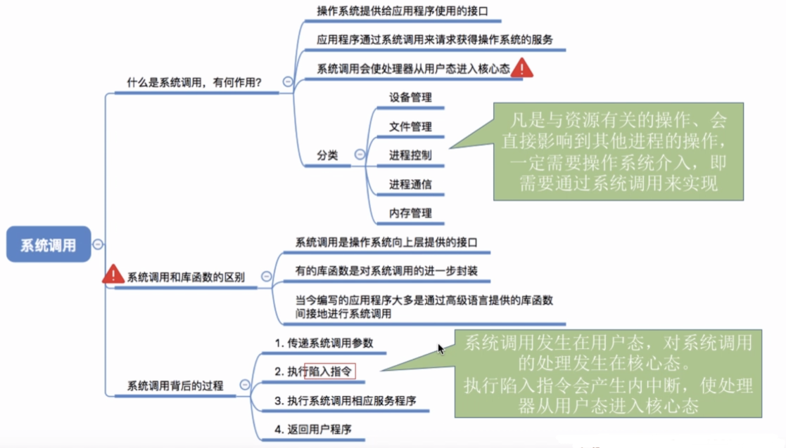 </div> 
<center class = "ex"></center><br>
<div class = "ex">系统调用</div><br>

---

## 进程
**进程的定义**
进程可以看成程序执行的一个实例（进程是一个动态的执行过程）。<b>程序段，数据段，PCB</b>三部分构成了进程实体。创建进程就是创建进程中的PCB，而撤销进程就是撤销进程中的PCB。
注意：<div style="color:#f0f;font-size:15px">PCB是进程存在的唯一标志！</div>

一个进程无法访问另一个进程的变量和数据结构，如果想让一个进程访问另一个进程的资源，需要使用进程间通信，比如管道，文件，套接字等。
一个进程可以拥有多个线程，每个线程使用其所属进程的栈空间。线程与进程的一个主要区别是，统一进程内的一个主要区别是，同一进程内的多个线程会共享部分状态，多个线程可以读写同一块内存（一个进程无法直接访问另一进程的内存）。同时，每个线程还拥有自己的寄存器和栈，其他线程可以读写这些栈内存。
线程是进程的一个实体，是进程的一条执行路径。

线程是进程的一个特定执行路径。当一个线程修改了进程的资源，它的兄弟线程可以立即看到这种变化。
- 进程是程序的一次执行，程序一旦运行就是进程。
- 进程是可以和别的计算并发执行的计算。
- 进程是定义在一个数据结构上并能在其上进行操作的一个程序。
- 进程是程序在一个数据集合上运行的过程，他是系统资源分配和调度的基本单位。

进程和程序的区别：
- 进程是动态的，程序是静态的：程序是有序代码的集合，属于静态文本的概念。进程是程序的一次执行。
- 进程是并发的，会相互制约，程序是顺序的。
- 进程是暂时的，程序是永久的
- 进程和程序的组成不同：进程的组成包括程序，数据和进程控制块（即进程的状态信息）。
- 进程与程序的对应关系：通过多次执行，一个程序可对应多个进程；通过调用关系，一个进程可以包括多个程序。
进程和线程的选择取决于以下几点：
1. 需要频繁创建销毁的优先使用线程；因为对进程来说创建和销毁一个进程的代价是很大的。
2. 线程的切换速度快，所以在需要大量计算，切换频繁时使用线程，还有耗时的操作时用使用线程可提高应用程序的响应。
3. 因为对CPU系统的效率使用上线程更占优势，所以可能要发展到多机分布的用进程，多核分布用线程。
4. 并行操作时用线程，如C/S架构的服务器端并发线程响应用户的请求。
5. 需要更稳定安全时，适合选择进程；需要速度时，选择线程更好。

进程的组成：有程序段、数据段和进程控制块组成。
进程控制块是进程的灵魂，是进程存在的唯一标志，操作系统为进程创建进程控制块和分配地址空间的过程就是创建进程的过程。
### 总结
<div align="center"> 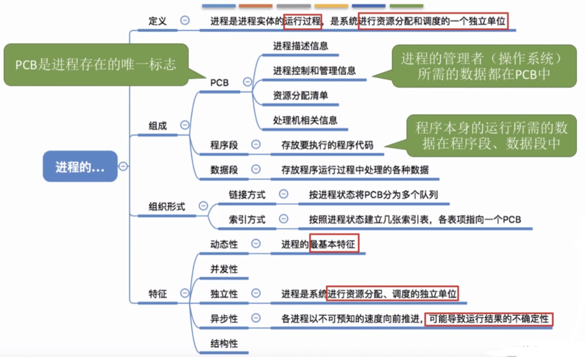 </div> 
<center class = "ex"></center>
<div class = "ex">进程的定义，组成和组织方式</div>

---

## 进程的状态与转换

进程的基本状态：
运行态：进程已经获得所需资源，并占有、CPU。
就绪态: 已经获得所需资源，只等待CPU。
阻塞态： 也称为等待态，挂起态或睡眠态等，进程等待某个事件。
此外还有新建态和终止态。
<div align="center"> 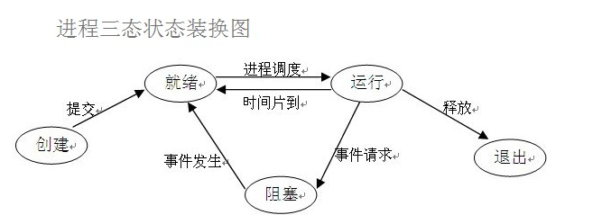 </div> 
<center class = "ex"></center>
<div class = "ex">引入虚拟内存管理的进程状态转换模型</div>
<br>
<div align="center"> 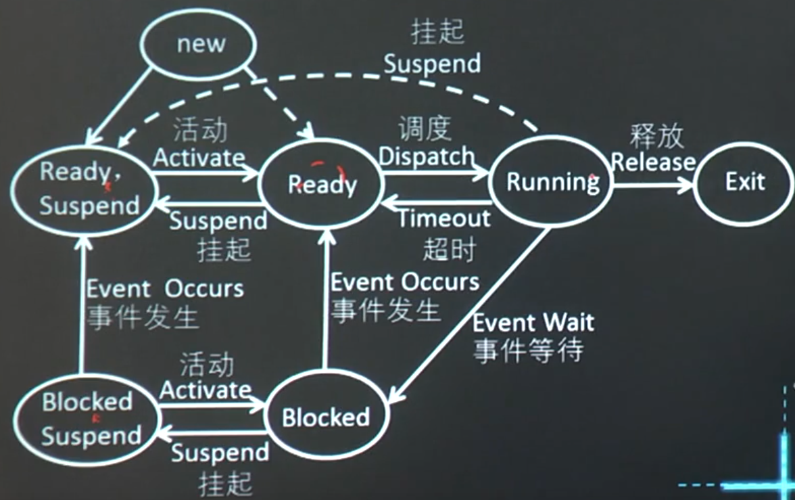 </div> 
<center class = "ex"></center>
<div class = "ex">引入虚拟内存管理的进程状态转换模型</div><br><br>
<div align="center"> 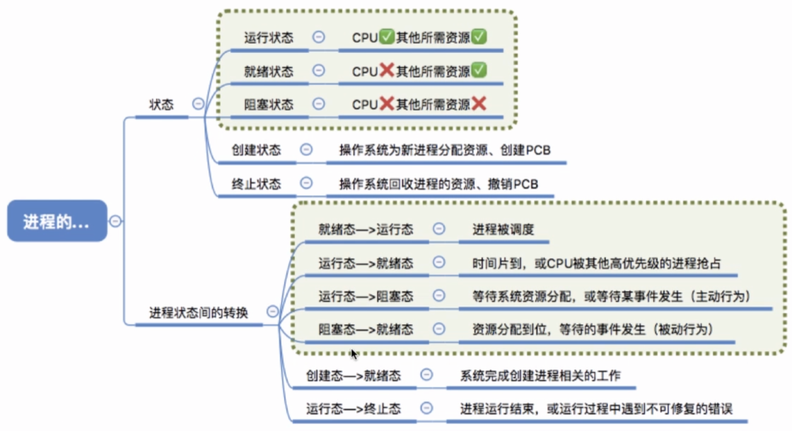 </div> 
<center class = "ex"></center>
<div class = "ex">进程的状态与转换</div>

---

## 进程的控制
进程控制的主要功能是对系统中所有的进程进行有效的管理，它具有创建进程，撤销进程，实现进程状态装换等功能。

进程控制会导致进程状态的转换。无论哪个原语，要做的无非三类事情：
1. 更新PCB中的信息（如修改进程状态、将运行环境保存到PCB、从PCB恢复运行环境）
2. 将PCB插入合适的队列
3. 分配/回收资源
### 进程的创建事件
以下情况下会引起进程的创建事件
（1）. 用户登录
（2）. 作业调度
（3）. 提供服务
（4）. 应用请求
### 进程的创建
（1）. 申请空白的PCB
（2）. 为新进程分配资源（主要是内存资源的处理）
（3）. 初始化进程控制块（标识符（包括父进程的）、程序计数器指向程序入口地址，就绪态、优先级等信息的填写。）
（4）. 将新进程插入就绪队列。
### 进程的终止
进程终止分为以下几种情况：
（1）. 正常结束
（2）. 异常结束
（3）. 外界干扰

步骤：
(1). 根据进程标示符，检索出该进程PCB，读其状态。
* IF 执行态，立即终止该进程，置调度标志为真，指示重新进行调度。
* IF 有子孙进程，亦应予以终止，以防成为不可控进程。

(2). 归还全部资源至其父进程或系统。
(3). 将该进程PCB从所在队列或链表中移出，回收进程拥有的全部资源。
<div align="center"> 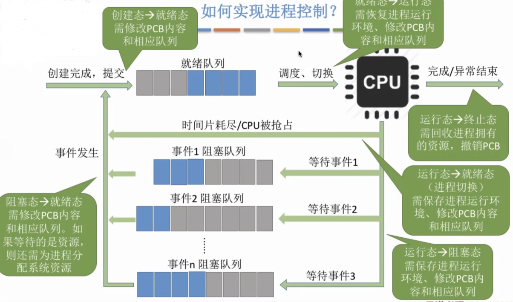 </div> 
<center class = "ex"></center>
<div class = "ex">如何实现进程控制</div>
### 进程的阻塞与唤醒
引起阻塞与唤醒的事件：
（1）. 请求系统服务的满足情况
（2）. 启动某种需等待（I/O）操作。
（3）. 需要的数据尚未到达。
（4）. 执行某功能的进程暂无新工作可做（如发送数据的进程）。

### 阻塞与唤醒过程:
由进程调用阻塞原语阻塞自己，是主动行为：
（1）将PCB中的状态改为阻塞
（2）该PCB加入到阻塞队列中
（3）转进程调度，将处理机分配给另一进程
（4）进行进程切换，即根据两切换进程的PCB，保护与重新设置处理机状态。
   注：阻塞与唤醒原语作用相反，成对使用

<br>
<div align="center"> 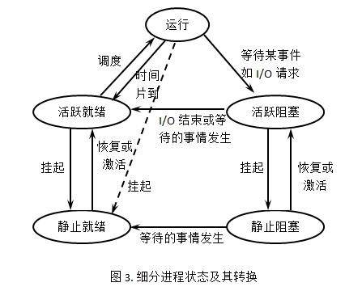 </div> 
<center class = "ex"></center>
<div class = "ex"></div>

### 总结

<br>
<div align="center"> 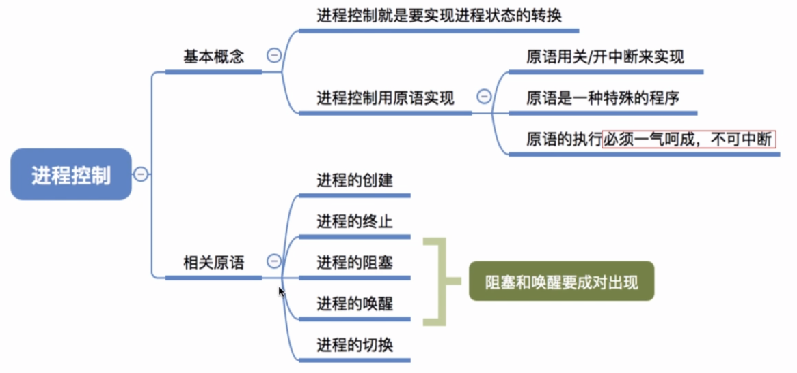 </div> 
<center class = "ex"></center>
<div class = "ex"></div>

---

## 进程通信

进程是分配系统资源的基本单位，因此进程拥有的内存地址空间相互独立。一个进程不能直接访问另一个进程的地址空间。
进程通信通常有**共享存储**，**消息传递**，**管道通信**三种方法。
<br>
<div align="center"> 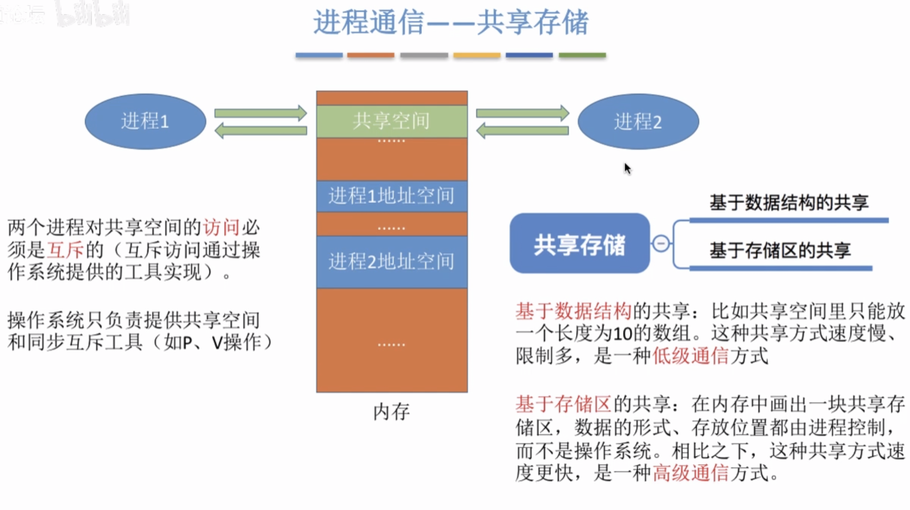 </div> 
<center class = "ex"></center>
<div class = "ex">共享存储</div><br>
<div align="center"> 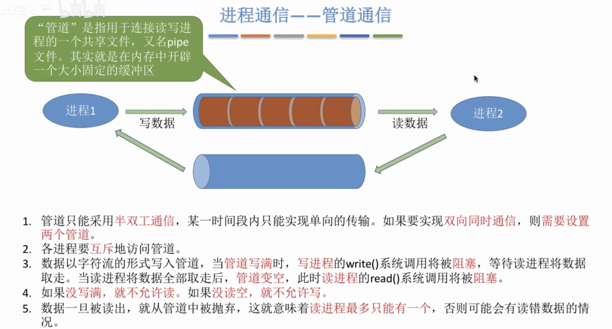 </div> 
<center class = "ex"></center>
<div class = "ex">管道通信</div>
<br>
<div align="center"> 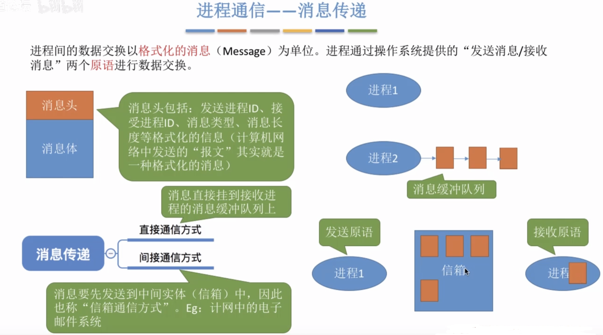 </div> 
<center class = "ex"></center>
<div class = "ex">消息传递</div>
### 总结
<br>
<div align="center"> 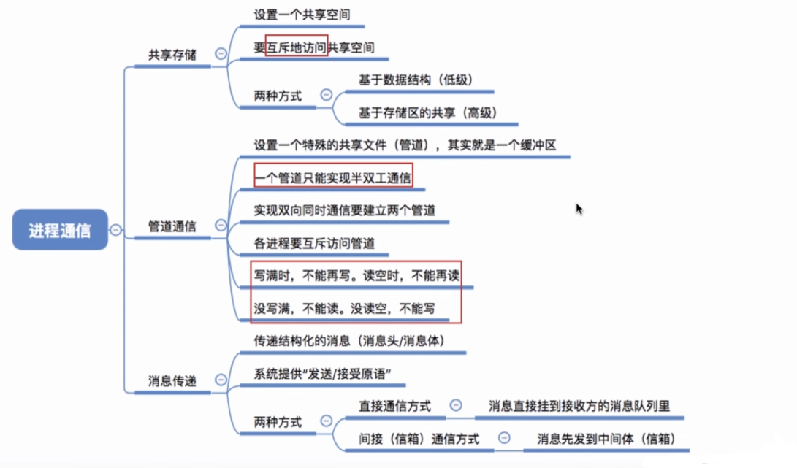 </div> 
<center class = "ex"></center>
<div class = "ex">消息传递</div>

### 进程的挂起与激活
挂起原语将指定进程或阻塞进程挂起。
（1）. 检查被挂起进程的状态，活动就绪则改为静止就绪，活动阻塞则改为静止阻塞
（2）. 将该PCB复制到内存（方便检查）/外存（对换）指定区域
（3）.  *若挂起的进程是执行态，则需重新进行进程调度。
注：  
¡  若挂起进程在外存上，将其调入内存
¡  检查进程状态，若处于静止就绪，则改为活动就绪，若处于静止阻塞，则改为活动阻塞

进程的激活：
进程的激活是进程挂起的相反过程。

### 进程间的相互作用
**同步**：
相互协作的进程共同为完成一个任务时，一个进程的某操作与协作进程的某个操作之间在时序上有一定关系，如果协作进程的某个操作没有完成，那么该进程就要等待这个操作完成才能继续下去，这种相互之间的关系成为进程的同步。


<br>
<div align="center"> 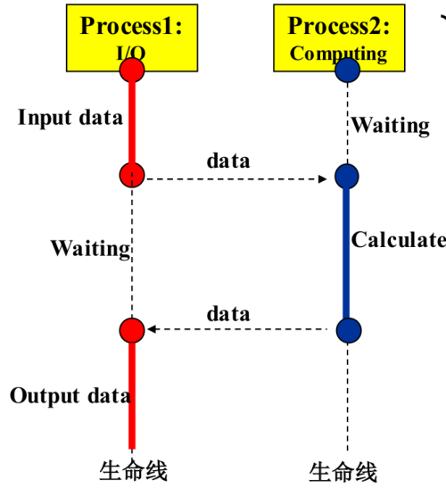 </div> 
<center class = "ex"></center>
<div class = "ex"></div>
如图所示：一个进程在执行操作的时候，另一个进程必须等待，体现在次序上的等待和协调，并不争夺临界资源。

**互斥**：
多个进程因为争夺临界资源二相互排斥执行的过程称为进程的互斥。
```
临界资源：也称为独占资源，是指在一段时间内只允许一个进程访问的资源。
临界区：一个程序片段的集合，在进程中涉及临界资源的程序段叫临界区。
```
使用临界区的原则：
（1）. 当由若干个进程要求进入临界区时，应使一个进程进入临界区，他们不应相互等待岁都不能进入。
（2）. 一次只允许一个进程进入临界区，即各进程互斥的访问临界资源。
（3）.各进程使用临界资源的时间是有限的，即任何一个进程都必须在有限的时间内释放所占有资源。
<br>
<div align="center"> 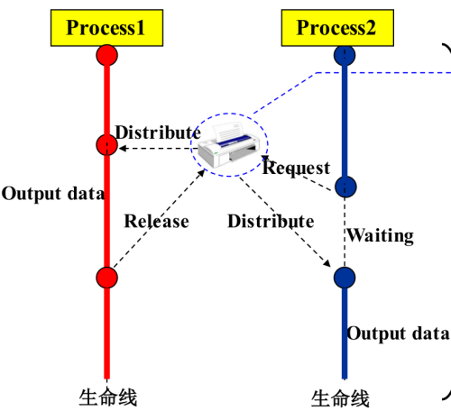 </div> 
<center class = "ex"></center>
<div class = "ex"></div>
<br>

### 操作系统的主要功能
#### 处理机管理功能
1. 进程控制
2. 进程的同步与互斥
3. 进程的通信
4. 调度（合理的调用CPU，提高资源的利用率）
#### 存储器管理功能
1. 内存分配
2. 内存保护（防止内存越界访问）
3. 地址映射
4. 内存扩充（虚拟内存）
#### 设备管理功能
1. 缓冲管理
2. 设备分配
3. 设备处理
#### 文件管理功能
1. 文件存数空间管理
2. 目录管理
3. 文件读写管理和保护

## 二、进程管理
重点：
掌握进程，线程，同步与互斥，进程通行的基本概念。理解引进进程的原因。进程的基本状态和进程状态变换的基本条件。使用信号量和P、V操作解决进程的同步与互斥。
- 多道程序设计及进程产生的原因。
- 进程的定义
- 进程的基本状态
- 进程的同步与互斥（重点）
- 进程通信
- 线程


并发执行的特征：
- 失去封闭性：共享资源，程序之间互相制约。
- 出现相互制约的关系：虽然每个程序独立存在，但由于程序并发执行，一个程序的执行要依赖于其他程序的执行结果，形成了相互制约的关系，
- 间断性：程序之间的制约关系致使程序执行时间不连贯。
- 不可在现性：失去封闭性，也就失去了可再现性，程序的执行结果随速度、环境的不同而不同。


**解决并发进程的问题**
（1）. 加锁法--自旋锁
　设置一个共享变量W (锁) ,初值为0。当一个进程想进入其临界区(进程中涉及临界资源的程序段)时,它首
先测试这把锁:如果锁的值为0,则进程将其置为1并进入临界区。若锁已经为1,则进程等待直到其变成0。
（2）. 使用信号量和PV操作

<div style="color:#00f;font-size:15px">信号量：</div>
是表示资源的实体，是一个与队列有关的整型变量，其值仅能由P、V操作改变。
信号量分为<b>共有信号量和私有信号量</b>。
<div style="color:#00f;font-size:15px">公有信号量：</div>
用于实现进程间的互斥，初值通常设为1，它所联系的一组并行进程均可对他实施P、V操作。
<div style="color:#00f;font-size:15px">私有信号量：</div>
用于实现进程间的同步，初始值通常设为0或n，允许拥有他的进程对其实施P操作。


用P、V操作解决进程间互斥问题


<br><br><br><br><br>
<br><br><br><br><br>
<br><br><br><br><br>
<br><br><br><br><br>
<br><br><br><br><br>
- 
|--|--|
|||