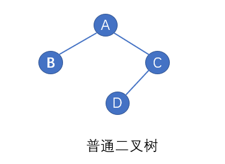
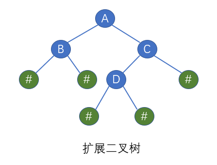

### 定义二叉树节点
```cpp
struct node
{
pubilc:
    int data;
    struct node *left_node;
    struct node *right_node;

};
```
### 二叉树的建立
通常给出一棵树的前序与中序遍历结果或者后序与中序遍历结果可以唯一的确定一颗二叉树，我们想要建立一颗二叉树，还要手动找出其前序和中序遍历结果，这种方式较为麻烦。我们希望能快速建立二叉树用来实现二叉树的花式遍历，单独的给出一个数组，让创建一颗二叉树，其创建方式太多了，为了唯一确定一颗二叉树，我们可以使用如下两种方式：
- 引入虚节点
为了让每个节点确认是否有左右孩子，我们对其进行扩展，为二叉树的每个节点的空指针引入一个虚节点，比如用“#”代替，这样就可以将原二叉树变成一棵扩展二叉树，如下图所述，其前序遍历结果为：   我们就可以由其前序遍历唯一生成一棵二叉树了。
<div align="center">  </div>
<div align="center">  </div>
- 实现代码如下：
```cpp
void CreatTree(node *T)
{

}
```